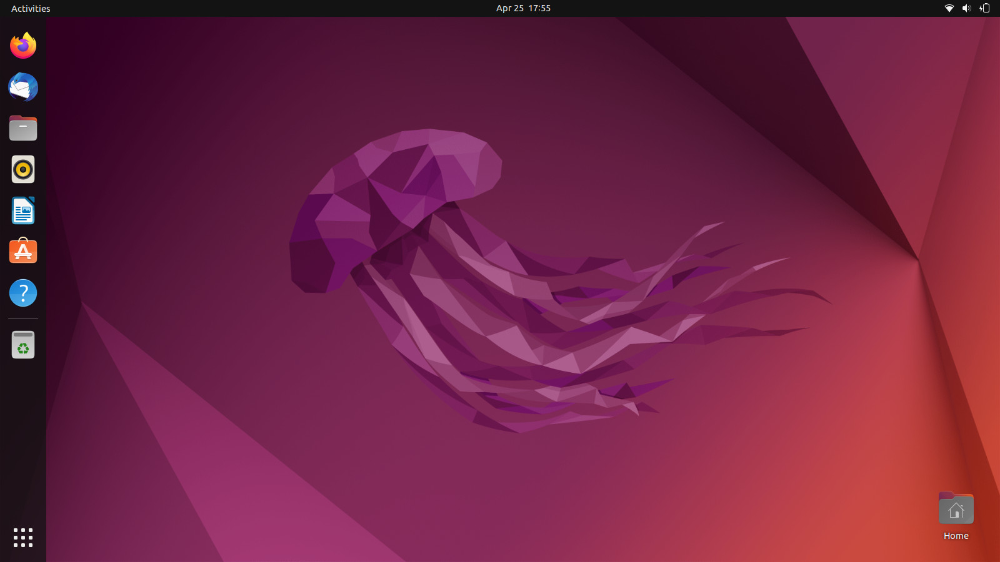

# Ubuntu 20.04 LTS Desktop Installation

## Minimum System Requirement

You will need:

* 4 GB RAM
* Dual Core Processor (2 GHz)
* 25 GB free Hard disk space
* Bootable flash drive

## Installation

Once the system is booted using the bootable disk, click "Install Ubuntu" to
continue with the installation process. Choose your favorite keyboard layout
and click "Continue". Next screen, select "Normal Installation",
"Download Updates While Installing Ubuntu" and "Install third party software".
Click on "Continue" to proceed with installation.

Next the installer presents you some installation options. Click the
"Advanced Features" if you need LVM, disk encryption or ZFS (see
[Security section](../security/README.md)). Choose the appropriate
installation type for you.

Again, click on "Continue" to write all the changes to the disks.

Choose your favorite time zone and then click on "Continue". You will be
prompted to provide your user credentials. The installation of Ubuntu 20.04
LTS starts and will take around 5-10 mins.

Once the installation is completed, restart your system.

