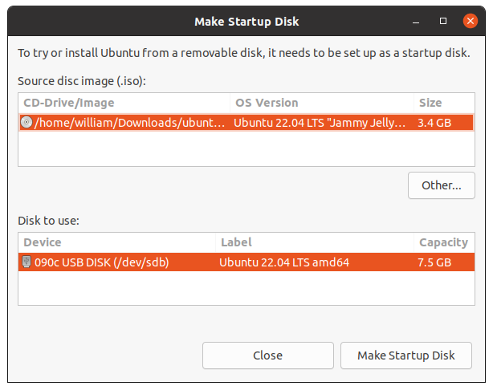

# How To Create A Bootable Live USB

Download the latest ISO from Ubuntu Desktop:
[https://www.ubuntu.com/download/desktop][ubuntu]

[ubuntu]: https://www.ubuntu.com/download/desktop

You will need a USB Stick/Flash Drive with a minimum 4 GB of free space.

If you are using Ubuntu you should have "Startup Disk Creator" installed that
will enable you to create a Live USB from an ISO image.

It's likely that both your Ubuntu ISO and the correct USB device will have
been detected and set as "Source disc image" and "Disk to use" in the
application window. If not, use the "Other" button to locate your ISO file
and select the exact USB device you want to use from the list of devices.

Select "Make Startup Disk" to start the process.

