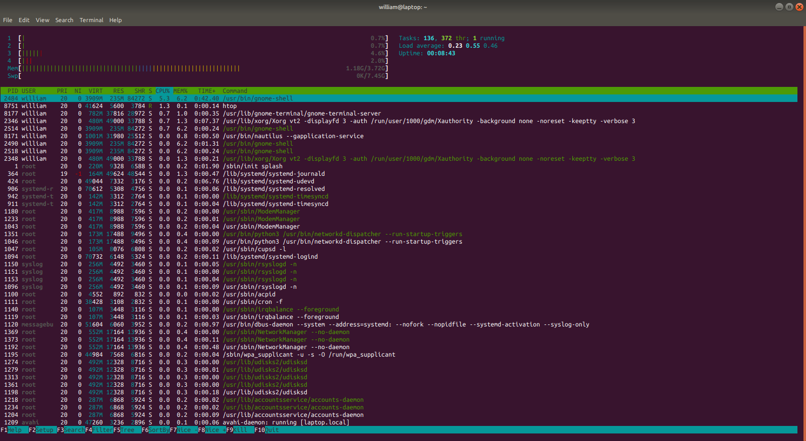

# Terminals

One of the most important applications for us is the terminal emulator. It
allows every user to get access to the shell. Bash is the most common shell
for Linux and UNIX distributions.

The [GNOME terminal](https://help.gnome.org/users/gnome-terminal/stable/) is
installed by default on Ubuntu. It supports colored text, a variety of
themes, transparency, mouse interaction and multiple tabs. The GNOME terminal
supports also multiple profiles, where users can create multiple profiles
account and can customize configuration options.

