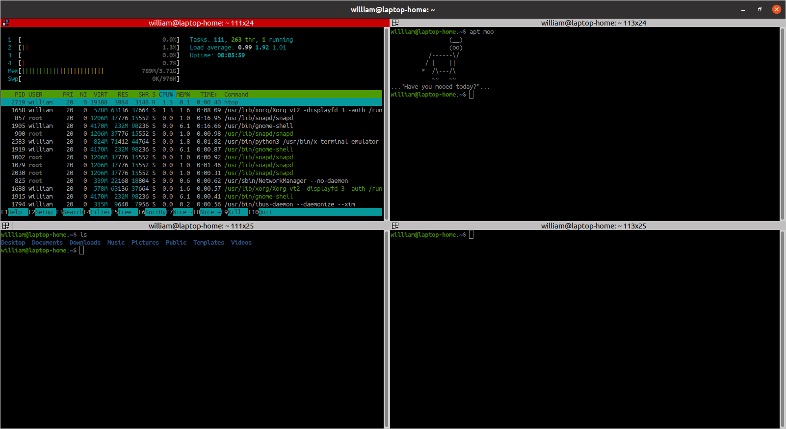

# Terminator

[Terminator](https://gnometerminator.blogspot.com/p/introduction.html) is a
terminal emulator that is designed to make arranging terminals within a
single window easier, with features including a number of keybindings, saving
of layouts, and the ability to type to multiple terminals at the same time.

## Installation

```bash
sudo apt install terminator
```

## Configuration

The configuration file is located in `~/.config/terminator/config`.

Configuration file includes all layouts, plugins, custom commands, etc.

## Color Schemes

Edit your Terminator configuration file and add the configurations for
the theme(s) you'd like to use.

See this set of [color schemes](https://github.com/mbadolato/iTerm2-Color-Schemes/tree/master/terminator).

## Screenshot


