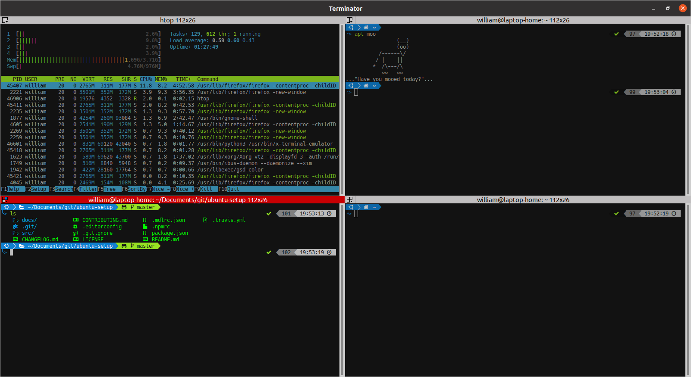

# Zsh

[Zsh](http://www.zsh.org/) is a shell designed for interactive use, although
it is also a powerful scripting language.

## Installation

To install Zsh:

```bash
sudo apt install zsh
```

To set Zsh as the default login shell:

```bash
sudo usermod -s /usr/bin/zsh $(whoami)
```

Now restart your computer and repoen your terminal.

If you don't already have a `~/.zshrc` configuration, copy the recommended
settings with:

```bash
cp /etc/zsh/newuser.zshrc.recommended .zshrc
```

## Configuration

The configuration file for zsh is called `.zshrc` and lives in your home
folder (`~/.zshrc`).

## Framework

[Oh My Zsh](https://github.com/robbyrussell/oh-my-zsh) is an open source,
community-driven framework for managing your zsh configuration.

To install Oh My Zsh framework:

```bash
sudo apt install git
sh -c "$(wget https://raw.githubusercontent.com/robbyrussell/oh-my-zsh/master/tools/install.sh -O -)"
```

## Plugins

Oh-My-Zsh has many plugins. You can find a list of pre-installed plugins at
[https://github.com/robbyrussell/oh-my-zsh/tree/master/plugins][zshplugins]

[zshplugins]: https://github.com/robbyrussell/oh-my-zsh/tree/master/plugins

You can add plugins to your shell by adding the name of the plugin in your
`.zshrc`.

```bash
plugins=(colored-man-pages git node npm)
```

## Themes

The default theme is `robbyrussell`. In order to enable a theme, set
`ZSH_THEME` to the name of the theme in your `~/.zshrc`.

You'll find a list of themes with screenshots on the
[Oh My Zsh Wiki](https://github.com/robbyrussell/oh-my-zsh/wiki/themes).

## Screenshot


